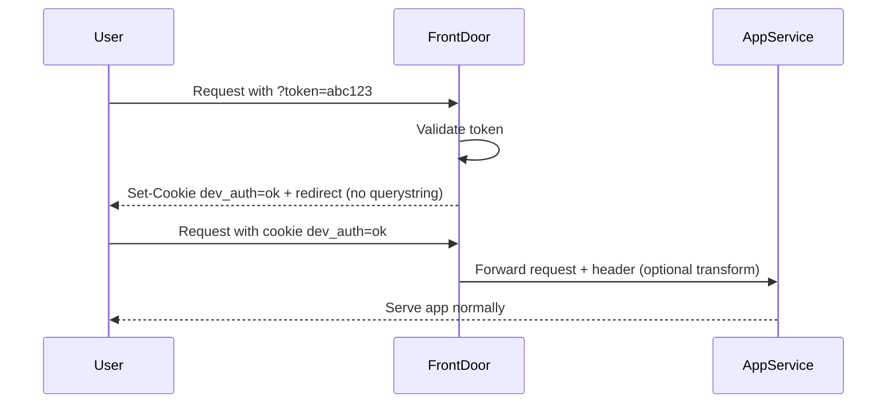

# 0001. Development environment access

**Date:** 02-09-2025  
**Status:** Accepted

## Context

Our development and research environments need to be publicly accessible on the internet to allow easy access for team members and external user research participants.

Currently, we protect access using HTTP Basic Authentication configured at the App Service level. This was originally intended as a lightweight barrier to prevent casual or unintended access (e.g. web crawlers).

However, Basic Authentication is increasingly disabled in modern browsers (for example, Edge can block it entirely via enterprise policies), which has already caused access issues for some users. In addition, maintaining Basic Auth independently on each App Service is repetitive and doesn’t provide a centralised mechanism for managing access.

We therefore need a replacement approach that:

- Keeps unauthorised users and crawlers out of our dev environments.
- Is lightweight and easy for internal and external users to use.
- Can be managed centrally (via Front Door) rather than per App Service.
- Avoids introducing significant additional infrastructure or cost.
- Supports one-off access for external participants in user research sessions.

## Evaluation

We considered five options:

1. **Front Door cookie login page** – a static login page sets a cookie; Front Door checks for its presence before routing traffic.
2. **Front Door header or cookie→header** – require a header to be set, either manually (via proxy/extension) or transformed from a cookie set by a login page.
3. **App-level auth** – remove extra barriers and rely only on existing service authentication.
4. **IP whitelisting** – allow access only from approved IPs.
5. **“Magic links”** – use Front Door rules with a querystring token promoted to a cookie. Tokens are generated via Terraform/GitHub Actions and rotated for each user research session.

We scored each option against criteria from 1 (poor) to 5 (excellent):

| Criteria                                 | Option 1 | Option 2 | Option 3 | Option 4 | Option 5 |
| ---------------------------------------- | -------- | -------- | -------- | -------- | -------- |
| Ease of setup & maintenance              | 4        | 3        | 2        | 2        | 3        |
| User friendliness (esp. UR participants) | 3        | 2–3      | 2        | 1        | 5        |
| Centralisation (via Front Door)          | 5        | 5        | 1        | 5        | 5        |
| Cost impact                              | 5        | 5        | 5        | 4        | 5        |
| Security (vs. crawlers / casual access)  | 4        | 4        | 3        | 2        | 4        |
| Flexibility for UR participants          | 2        | 2–3      | 2        | 1        | 5        |
| **Total**                                | 23       | 21–23    | 15       | 15       | **27**   |

**Outcome:** Option 5 (“magic links”) scored the highest overall. It provides the smoothest user experience for external research participants, keeps access centralised at Front Door, and can be automated via GitHub Actions and Terraform to minimise maintenance burden.

## Decision

We will implement **Option 5 (“magic links”)**.

This will use Azure Front Door Rules Engine to enforce access based on a token provided as a query string. When a user first visits via a magic link, Front Door will validate the token, set a secure cookie (e.g. `dev_auth=ok`), and redirect the user to the same page without the query string. This allows access to persist across multiple pages without appending the querystring repeatedly.

Tokens will be managed as Terraform variables, with a GitHub Actions workflow generating new random tokens on demand. Research facilitators will be able to trigger the workflow, obtain a temporary link, and share it with participants.

This approach provides a lightweight, centralised solution that is easy for participants (just click a link), does not require new infrastructure or additional code inside App Services, and supports temporary access patterns for research.

## Considerations on selected technology

- **Ease of access**: Participants only need to click a link; no password entry or browser setup required.
- **Security**:
  - Not a replacement for production-grade authentication.
  - Sufficient to block crawlers and casual access.
  - Tokens rotated regularly; older tokens invalidated.
- **Persistence**: Querystring is only used on the first request. Session is persisted via cookie, ensuring redirects and navigation work normally.
- **Scalability**: Front Door rules can support multiple environments consistently.
- **Maintainability**: Managed in Terraform, triggered via GitHub Actions. This keeps setup simple, repeatable, and version-controlled.
- **Risks**:
  - Links can be shared beyond the intended participant until rotated. This is acceptable for UR use but should not be used for sensitive data.
  - Workflow discipline is required to rotate tokens after research sessions.
  - Care must be taken to configure cookies securely (`Secure`, `SameSite=Strict`) to avoid leakage.

## Flow (high-level)

