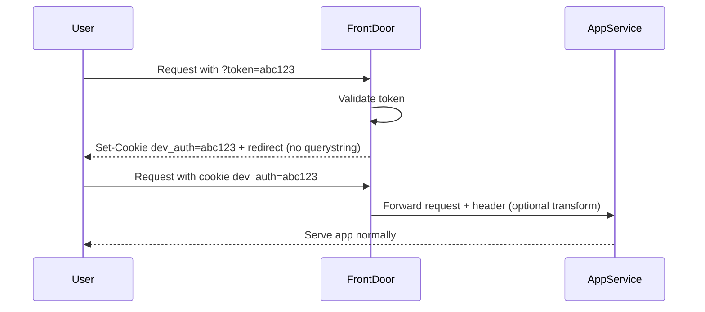

# 0001. Development environment access

**Date:** 02-09-2025  
**Status:** Accepted

## Context

Our development and research environments need to be publicly accessible on the internet to allow easy access for team members and external user research participants.

Currently, we protect access using HTTP Basic Authentication configured at the App Service level. This was originally intended as a lightweight barrier to prevent casual or unintended access (e.g. web crawlers).

However, Basic Authentication is increasingly disabled in modern browsers (for example, Edge can block it entirely via enterprise policies), which has already caused access issues for some users. In addition, maintaining Basic Auth independently on each App Service is repetitive and doesn’t provide a centralised mechanism for managing access.

We therefore need a replacement approach that:

- Keeps unauthorised users and crawlers out of our dev environments.
- Is lightweight and easy for internal and external users to use.
- Can be managed centrally (via Front Door) rather than per App Service.
- Avoids introducing significant additional infrastructure or cost.
- Supports one-off access for external participants in user research sessions.

## Evaluation

We considered five options:

1. **Front Door cookie login page** – a static login page sets a cookie; Front Door checks for its presence before routing traffic.
2. **Front Door header or cookie→header** – require a header to be set, either manually (via proxy/extension) or transformed from a cookie set by a login page.
3. **App-level auth** – remove extra barriers and rely only on existing service authentication.
4. **IP whitelisting** – restrict access to known IPs. This could be partially automated with a GitHub workflow (see [SfSW project for an example](https://github.com/DFE-Digital/SfSW-Infra/blob/main/.github/workflows/ip-whitelist.yml)) to reduce manual effort for adding team member IPs. However, this is only practical when all users are on the team. It does not work well for user research participants where acquiring their IPs would be difficult or not possible, and can cause issues when developers use dynamic IPs or VPNs.
5. **“Magic links”** – use Front Door rules with a querystring token promoted to a cookie. Tokens are generated via Terraform/GitHub Actions and can be rotated for each user research session.

We scored each option against criteria from 1 (poor) to 5 (excellent):

| Criteria                                 | Option 1                                                                | Option 2                                                                   | Option 3                                                                                                                       | Option 4                                                 | Option 5                                                     |
| ---------------------------------------- | ----------------------------------------------------------------------- | -------------------------------------------------------------------------- | ------------------------------------------------------------------------------------------------------------------------------ | -------------------------------------------------------- | ------------------------------------------------------------ |
| Ease of setup & maintenance              | 4 – Simple static page + rule                                           | 3 – Slightly more setup with transforms                                    | 5 – Already exists                                                                                                             | 3 – Easier with GitHub workflow, but still awkward       | 3 – Needs workflow/rotation, but centralised                 |
| User friendliness (esp. UR participants) | 3 – Users must type shared password and then log into the service again | 2–3 – Headers require extensions or proxy, cookie transform variant better | 5 – Users just have to log in once                                                                                             | 1 – Not viable for external participants                 | 5 – Just click a link, no input, app level auth still needed |
| Centralisation (via Front Door)          | 5 – Rules at edge                                                       | 5 – Rules at edge                                                          | 1 – Auth logic per app                                                                                                         | 5 – Rules at edge                                        | 5 – Rules at edge                                            |
| Cost impact                              | 5 – No new infra                                                        | 5 – No new infra                                                           | 5 – No new infra                                                                                                               | 4 – No infra cost, but operational overhead              | 5 – No new infra, reuses workflows                           |
| Security (vs. crawlers / casual access)  | 4 – Shared password deters bots but can leak                            | 4 – Custom header/cookie blocks bots                                       | 3 – Depends on each app’s implementation                                                                                       | 3 – Strong if IPs are stable, weak with VPNs/dynamic IPs | 4 – Rotating tokens strong enough for UR                     |
| Flexibility for UR participants          | 2 – Same password for everyone                                          | 2–3 – UX clunky without login page                                         | 2 – No way to issue temporary access, requires manual creation/deletion of accounts. Account deletion currently not supported. | 1 – Doesn’t scale to external users                      | 5 – Easy temporary access per session                        |
| **Total**                                | **23**                                                                  | **21–23**                                                                  | **21**                                                                                                                         | **17**                                                   | **27**                                                       |

**Outcome:** Option 5 (“magic links”) scored the highest overall. It provides the smoothest user experience for external research participants, keeps access centralised at Front Door, and can be automated via GitHub Actions and Terraform to minimise maintenance burden.

## Decision

We will implement **Option 5 (“magic links”)**.

This will use Azure Front Door Rules Engine to enforce access based on a token provided as a query string. When a user first visits via a magic link, Front Door will validate the token, set a secure cookie (e.g. `dev_auth=<token>`), and redirect the user to the same page without the query string. This allows access to persist across multiple pages without appending the querystring repeatedly.

Tokens will be managed as Terraform variables, with a GitHub Actions workflow generating new random tokens on demand. Research facilitators will be able to request a token, either by triggering the workflow directly or with support from the dev team, obtain a temporary link, and share it with participants.
As a further improvement, as part of the workflow, we could store the current generated link with token in Confluence, post it to Teams, or share it elsewhere for easy reference in future.

This approach provides a lightweight, centralised solution that is easy for participants (just click a link), does not require new infrastructure or additional code inside App Services, and supports temporary access patterns for research.

## Considerations on selected technology

- **Ease of access**: Participants only need to click a link; no password entry or browser setup required.
- **Security**:
  - Not a replacement for production-grade authentication. Will purely be used to restrict access to non-prod environments.
  - Sufficient to block crawlers and casual access.
  - Tokens rotated regularly; older tokens invalidated.
- **Persistence**: Querystring is only used on the first request. Session is persisted via cookie, ensuring redirects and navigation work normally.
- **Scalability**: Front Door rules can support multiple environments consistently.
- **Maintainability**: Managed in Terraform, triggered via GitHub Actions. This keeps setup simple, repeatable, and version-controlled.
- **Risks**:
  - Links can be forwarded/shared beyond the intended participant until rotated. This is acceptable for UR use but should not be used for sensitive data.
  - Workflow discipline is required to rotate tokens after research sessions.
  - Care must be taken to configure cookies securely (`Secure`, `SameSite=Strict`) to avoid leakage.

## Flow (high-level)

