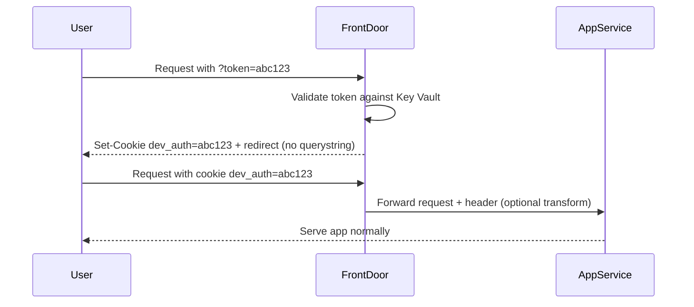

# Magic Links - Development Environment Access

## Table of Contents

- [Overview](#overview)
- [How It Works](#how-it-works)
- [Using the Magic Link Workflow](#using-the-magic-link-workflow)
  - [Prerequisites](#prerequisites)
  - [System Requirements](#system-requirements)
  - [Running the Workflow](#running-the-workflow)
- [Retrieving Magic Link Tokens](#retrieving-magic-link-tokens)
- [Troubleshooting](#troubleshooting)
  - [Common Issues](#common-issues)
  - [Workflow Failure Recovery](#workflow-failure-recovery)
- [Security Considerations](#security-considerations)
  - [Best Practices](#best-practices)
  - [Security Limitations](#security-limitations)
  - [Monitoring and Alerting](#monitoring-and-alerting)
- [Managing Firewall Exceptions](#managing-firewall-exceptions)
  - [Understanding Exception Paths](#understanding-exception-paths)
  - [Current Exception Paths](#current-exception-paths)
  - [Adding Additional Exceptions](#adding-additional-exceptions)
- [Quick Reference](#quick-reference)
  - [Emergency Token Rotation](#emergency-token-rotation)
  - [Environment-Specific Information](#environment-specific-information)
- [Related Documentation](#related-documentation)

## Overview

Magic Links provide a secure, user-friendly mechanism for accessing development and research environments without requiring traditional authentication methods like Basic Auth. This system uses Azure Front Door Rules Engine to validate tokens provided as query parameters, which are then converted to secure cookies for persistent access.

### Key Benefits

- **User-friendly**: Users simply click a link - no password entry required
- **Centralized management**: Access control managed at Front Door level, not per App Service
- **Temporary access**: Easy to rotate tokens for user research sessions
- **Crawler protection**: Blocks unauthorized access and web crawlers
- **No infrastructure cost**: Reuses existing Front Door and Key Vault infrastructure

## How It Works

### Architecture



### Components

1. **Azure Key Vault**: Securely stores the current magic link token and manages secret rotation
2. **Azure Front Door Rules Engine**: Validates incoming tokens against Key Vault and manages authentication cookies
3. **WAF Policy**: Provides web application firewall protection with custom rules for token validation
4. **GitHub Actions Workflow**: Automates token rotation, infrastructure updates, and provides operational control

### Security Features

- **Token validation**: Only requests with valid tokens are allowed through
- **Cookie security**: Uses `Secure`, `HttpOnly`, and `SameSite=Lax` flags
- **IP blocking**: Default deny-all rule blocks unauthorized IPs
- **Health check allowance**: Permits access to `/version.txt` and `/api/health` endpoints
- **Token rotation**: Regular token updates invalidate old access links

## Using the Magic Link Workflow

### Prerequisites

To use the Magic Links workflow, you need:

- **Repository Access**: Access to the repository's Dev environment to trigger workflows
- **Azure Permissions**: Service principal with appropriate Azure permissions configured for GitHub Actions
- **Infrastructure Access**: Terraform state access for the target environment

### System Requirements

For the Magic Links feature to function, the following must be in place:

- **Azure Key Vault**: Contains the `MagicLink-Token` secret with current token value
- **Azure Front Door**: Configured with WAF policy containing token validation rules
- **Terraform Infrastructure**: Magic Links module deployed and configured
- **GitHub Actions**: Workflow configured with proper Azure authentication

### Running the Workflow

1. **Navigate to GitHub Actions**: Go to the repository's Actions tab
2. **Find the workflow**: Locate "Generate Magic Link Token"
3. **Trigger manually**: Click "Run workflow" button

#### Workflow Parameters

| Parameter               | Description                                  | Required | Default           |
| ----------------------- | -------------------------------------------- | -------- | ----------------- |
| `environment`           | Target environment (d01, d02, d03)           | Yes      | d01               |
| `reason`                | Reason for token rotation                    | No       | "Manual rotation" |
| `skip_token_generation` | Skip token generation, only update Terraform | No       | false             |

#### Example Usage Scenarios

##### Regular Token Rotation

```yaml
environment: d02
reason: "Weekly security rotation"
skip_token_generation: false
```

##### Infrastructure Updates Only

```yaml
environment: d01
reason: "Front Door configuration update"
skip_token_generation: true
```

##### User Research Session

```yaml
environment: d03
reason: "User research session - external participants"
skip_token_generation: false
```

## Retrieving Magic Link Tokens

### From Azure Key Vault

After successful workflow completion:

1. **Navigate to Azure Portal**: Go to your resource group
2. **Open Key Vault**: Find the environment-specific Key Vault (e.g., `d01-swip-kv-primary`)
3. **Access Secrets**: Navigate to Settings → Secrets
4. **Retrieve token**: Find the `MagicLink-Token` secret and copy its value

### Constructing Access URLs

The magic link follows this format:

```
https://your-domain.com?token=<retrieved-token-value>
```

**Example:**

```
https://d01-social-work-induction-programme-digital-service.azurefd.net/?token=a1b2c3d4e5f6g7h8i9j0k1l2m3n4o5p6
```

## Troubleshooting

### Common Issues

#### 1. "Magic links are disabled in this environment"

**Symptoms**: Workflow shows warning about disabled magic links

**Cause**: `magic_links_enabled = false` in environment's `env.tfvars`

**Solution**:

1. Update the environment configuration:
   ```hcl
   # terraform/envs/{environment}/env.tfvars
   magic_links_enabled = true
   ```
2. Commit and push the changes
3. Re-run the workflow

#### 2. "Failed to update Key Vault secret"

**Symptoms**: Workflow fails at Key Vault update step

**Causes**:

- Insufficient Azure permissions
- Key Vault access policies not configured
- Network restrictions

**Solutions**:

1. **Verify Key Vault access policies**:

   - Ensure your service principal has `Secret Get`, `Secret Set`, and `Secret List` permissions
   - Check if Key Vault firewall is blocking access
   - Review Azure Portal: Key Vault → Access Policies

2. **Test permissions via workflow**:

   - Run the workflow with `skip_token_generation: true`
   - This will test Terraform connectivity without generating a new token
   - If it fails at Key Vault step, permissions need to be updated

3. **Check Azure Portal directly**:
   - Navigate to Key Vault in Azure Portal
   - Attempt to view existing secrets
   - Try creating a test secret manually through the portal

#### 3. "Front Door rules were NOT updated"

**Symptoms**: Token updated but Front Door configuration unchanged

**Causes**:

- Terraform state corruption
- Front Door resource locks
- Insufficient permissions

**Solutions**:

1. **Verify Front Door permissions**:

   - Ensure service principal has `Contributor` role on Front Door resource
   - Check for resource locks on Front Door
   - Review Azure Portal: Front Door → Access Control (IAM)

2. **Test permissions via workflow**:

   - Run the workflow with `skip_token_generation: false`
   - This will test both Key Vault and Front Door access
   - Review the workflow logs carefully to identify the specific failure reason
   - Common issues include: permissions, network connectivity, resource locks, or configuration errors

3. **Manual Front Door update** (if needed):
   - Azure Portal → Front Door → WAF Policy
   - Update the token values in custom rules
   - Navigate to: Front Door → Settings → WAF Policy → Custom Rules
   - ⚠️ **Terraform Drift Warning**: Manual changes may be overwritten by future workflow runs.

#### 4. "Links not working after token rotation"

**Symptoms**: Previously working links fail after rotation

**Cause**: Old tokens cached in browser or CDN

**Solutions**:

1. **Clear browser cookies** for the domain
2. **Wait for CDN cache invalidation** (up to 5 minutes)
3. **Check cookie settings**: Ensure cookies are not blocked
4. **Try incognito/private browsing mode** to test with fresh session state

### Workflow Failure Recovery

#### Scenario 1: Token Generated, Key Vault Updated, Terraform Failed

**State**: ✅ Token in Key Vault, ❌ Front Door rules outdated

**Recovery Steps**:

1. **Identify the issue**: Review workflow logs for specific error
2. **Fix the problem**: Address Terraform configuration or permissions
3. **Re-run workflow**: Execute again (token will be regenerated)
4. **Alternative**: Manual Front Door update via Azure Portal
   - ⚠️ **Terraform Drift Warning**: Manual changes may be overwritten by future workflow runs.

#### Scenario 2: Token Generation Failed, Partial Key Vault Update

**State**: ❌ Token not generated, ❌ Key Vault may be inconsistent

**Recovery Steps**:

1. **Check Key Vault state**:

   - Navigate to Key Vault in Azure Portal
   - Verify the `MagicLink-Token` secret exists and has a valid value
   - Note the current token value if present

2. **Manual token generation**:

   - Generate a new token using the GitHub workflow
   - Or create a new secret manually through Azure Portal:
     - Key Vault → Secrets → + Generate/Import
     - Name: `MagicLink-Token`
     - Value: Generate a random 32-character alphanumeric string

3. **Update Front Door manually** or re-run workflow
   - ⚠️ **Terraform Drift Warning**: Manual changes may be overwritten by future workflow runs.

#### Scenario 3: Complete Workflow Failure

**State**: ❌ No changes made, ❌ No infrastructure updates

**Recovery Steps**:

1. **Review error logs** thoroughly
2. **Check Azure permissions** and connectivity
3. **Verify service principal permissions** in Azure Portal
4. **Re-run workflow** after addressing issues

## Security Considerations

### Best Practices

1. **Regular Rotation**: Rotate tokens regularly, especially after user research sessions
2. **Link Sharing**: Share magic links only through secure channels
3. **Access Monitoring**: Monitor access logs for suspicious activity
4. **Token Storage**: Never store tokens in code repositories or logs

### Security Limitations

- **Not production-grade**: Designed for development environments only
- **Link forwarding**: Links can be shared beyond intended recipients
- **No user tracking**: Cannot identify individual users through magic links
- **Browser dependency**: Requires cookie support to function properly

### Monitoring and Alerting

Monitor these Azure resources for security events:

- Front Door access logs
- WAF policy logs
- Key Vault access logs
- Application Insights (if configured)

## Managing Firewall Exceptions

### Understanding Exception Paths

The Magic Links WAF policy includes configured exceptions that allow access to certain endpoints without requiring a valid magic link token. These exceptions are essential for:

- **Health monitoring systems** to check service availability
- **Load balancers** to verify endpoint health
- **Automated tooling** that needs to access specific endpoints

### Current Exception Paths

The following endpoints are currently configured as exceptions and remain accessible without magic links:

- `https://your-domain.com/version.txt` - Version information endpoint
- `https://your-domain.com/api/health` - Health check endpoint

### Adding Additional Exception Paths

If you need to add more exception paths to the firewall rules:

1. **Locate the Terraform configuration**:
   [terraform/modules/environment-stack/magic-links/main.tf](../../terraform/modules/environment-stack/magic-links/main.tf)

2. **Find the WAF policy custom rules** section:

   ```hcl
   custom_rule {
     name     = "AllowHealthChecks"
     priority = 50
     type     = "MatchRule"
     action   = "Allow"

     match_condition {
       match_variable = "RequestUri"
       operator       = "Contains"
       match_values   = ["/version.txt", "/api/health"]
     }
   }
   ```

3. **Add your new path** to the `match_values` array:

   ```hcl
   match_values = ["/version.txt", "/api/health", "/your-new-endpoint"]
   ```

4. **Deploy the changes**:
   - Commit and push your Terraform changes
   - Run the Magic Link workflow with `skip_token_generation: true` to update the infrastructure without rotating the token
   - Test that your new endpoint is accessible without a magic link

### Important Considerations

- **Security**: Only add exceptions for endpoints that truly need to be publicly accessible
- **Monitoring**: Consider whether these endpoints need authentication in production
- **Documentation**: Update this section when adding new exception paths
- **Testing**: Always test that your new exceptions work as expected

## Quick Reference

### Emergency Token Rotation

**Option 1: Use GitHub Workflow (Recommended)**

1. Run the Magic Link workflow with `skip_token_generation: false`
2. Retrieve the new token from Key Vault after completion
3. Update any shared links or documentation

**Option 2: Manual Azure Portal Update**

1. Navigate to Key Vault in Azure Portal
2. Generate a new random 32-character alphanumeric token
3. Update the `MagicLink-Token` secret with the new value
4. Update Front Door WAF policy rules with the new token
   - ⚠️ **Terraform Drift Warning**: Manual changes may be overwritten by future workflow runs.

### Environment-Specific Information

| Environment | Key Vault Name     | Front Door Profile     |
| ----------- | ------------------ | ---------------------- |
| d01         | s205d01-kv-primary | s205d01-fd-profile-web |
| d02         | s205d02-kv-primary | s205d02-fd-profile-web |
| d03         | s205d03-kv-primary | s205d03-fd-profile-web |

## Related Documentation

- [Architecture Decision Record](../architecture/architecture-decision-records/0001_Development-environment-access.md)
- [Terraform Module](../../terraform/modules/environment-stack/magic-links/)
- [GitHub Workflow](../../.github/workflows/generate-magic-link-token.yml)
- [Current Environments](Current%20Environments.md)
